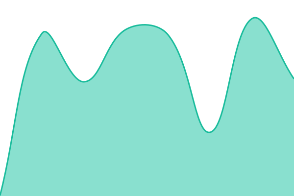
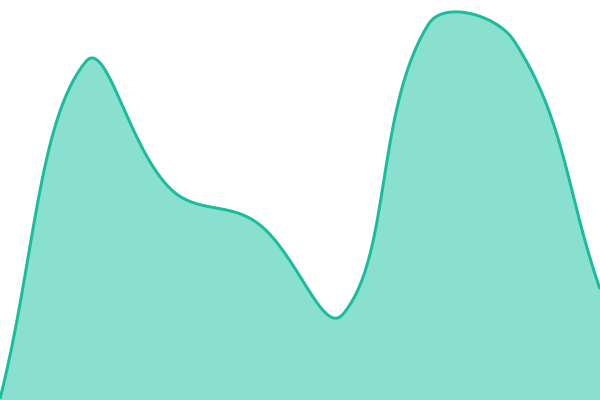

# [📈 Live Status](https://status.govspace.io): <!--live status--> **🟧 Partial outage**

This repository contains the open-source uptime monitor and status page for [GovSpace](https://status.govspace.io), powered by [Upptime](https://github.com/upptime/upptime).

With [Upptime](https://upptime.js.org), you can get your own unlimited and free uptime monitor and status page, powered entirely by a GitHub repository. We use [Issues](https://github.com/govspace/uptime/issues) as incident reports, [Actions](https://github.com/govspace/uptime/actions) as uptime monitors, and [Pages](https://status.govspace.io) for the status page.

<!--start: status pages-->
<!-- This summary is generated by Upptime (https://github.com/upptime/upptime) -->
<!-- Do not edit this manually, your changes will be overwritten -->
<!-- prettier-ignore -->
| URL | Status | History | Response Time | Uptime |
| --- | ------ | ------- | ------------- | ------ |
|  [Landing Page](https://govspace.io/) | 🟩 Up | [landing-page.yml](https://github.com/govspace/uptime/commits/HEAD/history/landing-page.yml) | 

 505ms
     
 | 

<a href="https://status.govspace.io/history/landing-page">100.00%</a>
    

|  [Web App](https://app.govspace.io/) | 🟩 Up | [web-app.yml](https://github.com/govspace/uptime/commits/HEAD/history/web-app.yml) | 

 254ms
     
 | 

<a href="https://status.govspace.io/history/web-app">100.00%</a>
    

|  [API Server](https://api.govspace.io/) | 🟥 Down | [api-server.yml](https://github.com/govspace/uptime/commits/HEAD/history/api-server.yml) | 

 94ms
     
 | 

<a href="https://status.govspace.io/history/api-server">0.00%</a>
    

|  [Recommendation Engine](https://rec.govspace.io/) | 🟩 Up | [recommendation-engine.yml](https://github.com/govspace/uptime/commits/HEAD/history/recommendation-engine.yml) | 

 101ms
     
 | 

<a href="https://status.govspace.io/history/recommendation-engine">100.00%</a>
    

|  [IPv6 test](forwardemail.net) | 🟥 Down | [i-pv6-test.yml](https://github.com/govspace/uptime/commits/HEAD/history/i-pv6-test.yml) | 

 0ms
     
 | 

<a href="https://status.govspace.io/history/i-pv6-test">100.00%</a>
    

<!--end: status pages-->

[**Visit our status website →**](https://status.govspace.io)

## 📄 License

- Powered by: [Upptime](https://github.com/upptime/upptime)
- Code: [MIT](./LICENSE) © [Anand Chowdhary](https://anandchowdhary.com), supported by [Pabio](https://pabio.com)
- Data in the `./history` directory: [Open Database License](https://opendatacommons.org/licenses/odbl/1-0/)
